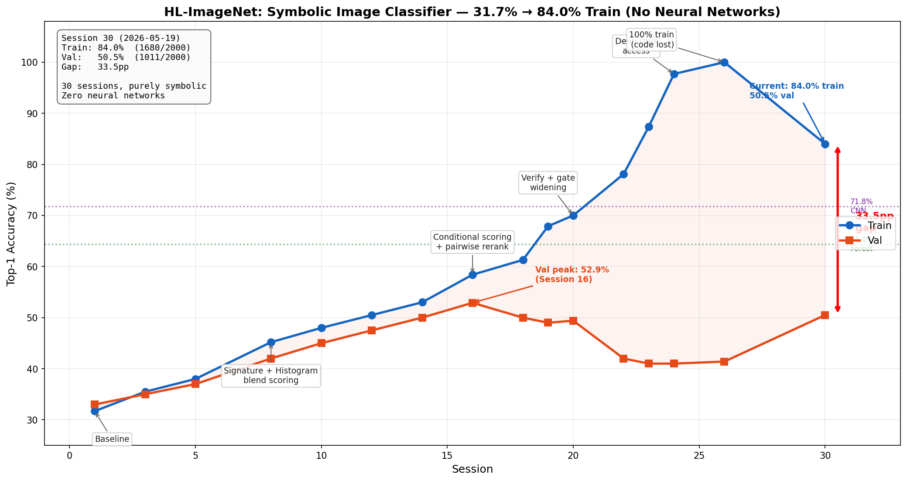

# HL-ImageNet: Heuristic-Learning Image Classification Without Neural Networks

**Claude Code and Codex iteratively built a symbolic image classifier using classical computer vision. The main pipeline uses no neural networks, no gradient descent, and no backpropagation.**

This is an application of Jiayi Weng's [Heuristic Learning](https://trinkle23897.github.io/learning-beyond-gradients/) framework to static image classification.

---

## Phase 2 (Current): 10-Class Real Image Classification

A proper train/val/test experiment with 10 real Tiny ImageNet classes. Train and validation use 2,000 images each; test uses 1,000 images.

### Current Reproducible Results

| System | Train top-1 | Val top-1 | Gap | Reading |
|--------|------------:|----------:|----:|---------|
| `base_rerank` | **55.4%** | **51.9%** | 3.5pp | Best generalizing symbolic core |
| `full` verify rules | **84.0%** | **50.5%** | 33.5pp | High train accuracy, weak transfer |
| archived historical endpoint | **100.0%** | not current ground truth | - | Reached in logs; exact code state is not currently reproducible |
| small CNN baseline | 76.0% | 71.8% | 4.2pp | Learned-representation reference |

The strict current claim is:

```text
base_rerank: 55.4% train / 51.9% val
full verify: 84.0% train / 50.5% val
```

The historical 100% train endpoint matters because it shows that symbolic code can fit the training set very aggressively. It is not used as the current reproducible headline because the exact code state that produced it is not present at `HEAD`.

### Interpretation

Phase 2 does **not** show that symbolic vision solves ImageNet-10. It shows a more specific boundary:

1. A symbolic HL system has enough capacity to fit real-image training data far beyond the initial baseline.
2. The best generalizing symbolic core is much lower: roughly 52% validation accuracy.
3. Verification rules can push train accuracy very high, but they expose a sharp memorization/generalization gap.
4. The likely gap to CNNs is not raw fitting capacity. It is learned reusable representation plus regularized credit assignment.

### 10 Classes

| # | Class | wnid | Main confusions |
|---|-------|------|-----------------|
| 1 | golden retriever | n02099601 | banana, brown bear, mushroom |
| 2 | mushroom | n07734744 | banana, brown bear, GR |
| 3 | teapot | n04398044 | king penguin, banana, GR |
| 4 | school bus | n04146614 | sports car |
| 5 | banana | n07753592 | orange, school bus |
| 6 | orange | n07747607 | banana |
| 7 | brown bear | n02132136 | mushroom, GR, school bus |
| 8 | king penguin | n02056570 | brown bear, sports car |
| 9 | jellyfish | n01910747 | king penguin |
| 10 | sports car | n04285008 | school bus, king penguin |

### Data Split

| Split | Images/class | Total | Purpose |
|-------|:---:|:---:|---------|
| **Train** | 200 | 2,000 | HL loop tuning |
| **Val** | 200 | 2,000 | Generalization reporting and audit |
| **Test** | 100 | 1,000 | Touched once at the very end |
| **External** | 50 | 500 | Official Tiny ImageNet val |

### Phase 2 Architecture

```
image (64x64 BGR)
  -> scene graph builder (color masks, edges, texture maps, blobs)
  -> 50+ low-level stats (hue ratios, edge density, gradients, LBP, spatial)
  -> 10 class signatures (weighted sum of sigmoid activations + guards)
  -> mean-centered histogram prototype blending
  -> calibration and class repulsion
  -> pairwise reranking (targeted discriminant pairs, gap-aware gating)
  -> optional verify rules
  -> prediction with proof trace
```

**Layer 1 — Class Signatures:** Each class has a signature — a weighted sum of sigmoid activations over image statistics, with guard gates:

```python
pos = sum(weight_i * sigmoid(stat_i, threshold_i, steepness_i) for each positive signal)
guards = [sigmoid(stat_j, threshold_j, negative_steepness) for each guard]
score = pos * min(guards)  # any guard can suppress the score
```

No hard binary thresholds. Each sigmoid contributes 0-1, and the sum represents soft match strength.

**Layer 2 — Histogram Prototype Blending:** 2D hue-saturation histograms are computed per class from training images. At inference, the image's histogram is compared to each class prototype. Mean-centered blending:

```
final = 0.88 * signature_score + 0.12 * (hist_score - class_mean * 0.3)
```

**Layer 3 — Pairwise Reranking with Gap-Aware Gating:** For the top-2/top-3 candidates, specialized discriminant functions compute evidence. A swap happens only when evidence exceeds a gap-scaled threshold:

```
swap iff disc_margin > base_threshold + score_gap * gap_scale
```

Targeted pairwise discriminant functions use per-pair base thresholds and rank-dependent gap scaling.

**Layer 4 — Verify Rules:** The `full` mode adds many narrow local/rank/final verification rules. These rules improve train accuracy from 55.4% to 84.0%, but reduce validation from 51.9% to 50.5%, so they are treated as a diagnostic overfitting layer rather than the main generalizing system.

### Pipeline Modes

| Mode | What it includes | Role |
|------|------------------|------|
| `base` | signatures + histogram blend + calibration/repulsion | Core symbolic scorer |
| `base_rerank` | `base` + pairwise reranking | Main generalizing symbolic result |
| `full` | `base_rerank` + verify rules | Train-fitting diagnostic |

### Phase 2 Accuracy Trajectory



### Phase 2 Experiment Logs

- [`docs/phase2/blog.md`](docs/phase2/blog.md) — Phase 2 writeup and reflection
- [`docs/phase2/lessons.md`](docs/phase2/lessons.md) — Lessons from the symbolic HL loop
- [`docs/phase2/understanding/`](docs/phase2/understanding/) — Distilled analyses of pipeline behavior
- [`logs/README.md`](logs/README.md) — Log lineage inventory and plotting rules
- [`logs/phase2/`](logs/phase2/) — Phase 2 eval logs (JSON + markdown)

---

## Lessons Learned (Both Phases)

The full Phase 2 reflection is in **[`docs/phase2/blog.md`](docs/phase2/blog.md)** and **[`docs/phase2/lessons.md`](docs/phase2/lessons.md)**. Highlights:

1. **Fitting is surprisingly doable** — symbolic verify rules can push train accuracy very high.
2. **Generalization is the hard part** — the best validation number comes from the smaller `base_rerank` system, not the full verify system.
3. **Pairwise reranking transfers better than narrow verification rules** — it targets reusable confusion structures instead of isolated failures.
4. **Global/coarse features hit a representation ceiling** — color coverage, edge density, texture stats, quadrant stats, and histogram prototypes do not substitute for learned local/part features.
5. **The codebase is the model** — thresholds, constants, prototypes, rule conditions, logs, tests, and update scripts together form the learned system.
6. **HL needs regularization and credit assignment** — future progress should reward reusable visual operators, held-out rule selection, patch-level attribution, and object-centered perception.

---

## The HL Loop

```
eval on train -> analyze confusion matrix -> hypothesize fix -> implement -> eval -> keep or revert -> repeat
```

Each iteration tests one hypothesis. Regressions are reverted. Claude Code and Codex maintain experiment logs, reasoning traces, plots, and feature distribution analyses throughout.

---

## Phase 1 (Completed): Exploratory Setup

<details>
<summary>Phase 1 used 4 real + 6 synthetic classes with a shared dev/eval set. Click to expand.</summary>

Phase 1 demonstrated that the HL loop works, but had evaluation methodology issues (tuning and eval on the same images).

### Phase 1 Results

- Dev-set top-1 (all 10 classes): **86.1%** (tuned on same 230 images)
- Held-out validation (4 hard classes): **54%** (216/400)
- Non-overlapping subset: **51.4%** (186/362)
- 248 iterations across 11 sessions (~20 hours)

### Phase 1 Architecture

Phase 1 used a completely different scoring system:

```
score = required_avg * 0.6 + supporting_avg * 0.3 - excluding_avg * 0.2
```

Each class had required, supporting, and excluding feature lists. If any required feature didn't fire, the class scored zero. This was replaced entirely in Phase 2 with the sigmoid-based scoring system.

Phase 1 also used a 22-function pairwise tiebreaker system (different from Phase 2's discriminant-based reranking).

### Phase 1 Growth Trajectory

```
Session 1:   ~20%   baseline sensors + features
Session 2:    35%   flat scorer (replaced broken hierarchy)
Session 3:    44%   compound features + tiebreakers
Session 4:    57%   tiebreaker expansion + school bus window pattern
Session 5:    62%   spatial attention + synthetic class tiebreakers
Session 6:    67%   eagle/banana solved to 100%
Session 7:    68%   plateau (DCT explored, failed)
Session 8:    78%   banana cap + compound conjunctions
Session 9:    80%   gradient/green conjunctions
Session 10:   85%   alt required features + guard tightening
Session 11:   86%   green+warm counter-signals (final)
```

### Phase 1 Ceiling

The remaining 32 errors (14%) came from the dog/mushroom/teapot triangle: at 64x64, all three are "warm-colored smooth blobs."

### Phase 1 Honesty Notes

1. The 86.1% is dev-set accuracy (same images used for tuning).
2. 6 of 10 classes used trivial synthetic images. The evaluation claim should be read as 4-class.
3. The system stores histogram prototypes and ~50 tuned thresholds. Not "zero learned parameters."
4. What Phase 1 demonstrated: the HL loop works. Confusion-driven iteration, feature invention, and representation saturation are real phenomena.

See the [full blog post](docs/phase1/blog.md) for trajectory analysis and ceiling discussion.

### Phase 1 Plots


</details>

---

## Project Structure

```
hl-image-net/
├── hlinet/
│   ├── sensors/           # Classical vision: edges, color, texture, segmentation, shape
│   ├── scene/             # Scene graph builder + spatial relations
│   ├── features/
│   │   ├── primitives/    # Color, shape features
│   │   ├── textures/      # Pattern detection
│   │   ├── parts/         # Structural parts
│   │   ├── spatial/       # Grid + layout predicates
│   │   ├── compounds/     # Phase 2 signatures, histogram prototypes
│   │   └── concepts/      # High-level concept detectors
│   ├── classifier/
│   │   ├── predict.py     # Phase 2: signatures -> blend -> rerank -> predict
│   │   ├── scorer.py      # Phase 1: flat scorer (legacy)
│   │   ├── hierarchy.py   # Class hierarchy
│   │   └── tiebreaker.py  # Phase 1: pairwise tiebreakers (legacy)
│   ├── eval/              # Dataset loader, metrics, evaluation runner
│   └── registry.py        # Feature registry
├── scripts/
│   ├── plot01_trajectory.py  # Generate the Phase 2 trajectory plot
│   └── predict_image.py   # Classify a single image
├── data/phase2/           # Train/val/test splits (not in repo)
├── logs/
│   ├── README.md          # Log lineage inventory and plotting rules
│   ├── log_inventory.csv  # Machine-readable audit inventory
│   ├── phase1/            # Cleaned Phase 1 eval logs
│   ├── phase2/            # Cleaned Phase 2 eval logs
│   └── generalization/    # Generalization checks and summaries
└── docs/
    ├── phase1/            # Exploratory setup, report, blog, plots
    ├── phase2/            # Main hand-built symbolic pipeline docs, understanding, reflections
    ├── anycode/           # Side experiment: unconstrained compiled classifiers
    └── phase3/            # Forward plan for local perception
```

## Quick Start

```bash
pip install -e .

# Run evaluation (defaults to val set)
python -m hlinet.eval.runner

# Run on train set
python -m hlinet.eval.runner --data-dir data/phase2/train

# Classify a single image
python scripts/predict_image.py path/to/image.jpg
```

## Technical Details

- **Language**: Python >=3.11
- **Dependencies**: OpenCV, NumPy, SciPy, scikit-image, scikit-learn, NetworkX, Matplotlib
- **Symbolic pipeline constraint**: no neural-network framework, no backpropagation, no learned embedding model
- **Eval log inventory**: tracked in [`logs/README.md`](logs/README.md) and [`logs/log_inventory.csv`](logs/log_inventory.csv)
- **Phase 1**: 250 archived eval records, exploratory setup
- **Phase 2**: 976 archived eval records, real 10-class symbolic pipeline
- **Coding agents**: Claude Code and Codex

---

## Citation

```
Heuristic Learning for Image Classification: Without Neural Networks.
Xisen Wang, May 2026.
```

## References

Weng, J. (2026). *Learning Beyond Gradients*. https://trinkle23897.github.io/learning-beyond-gradients/
