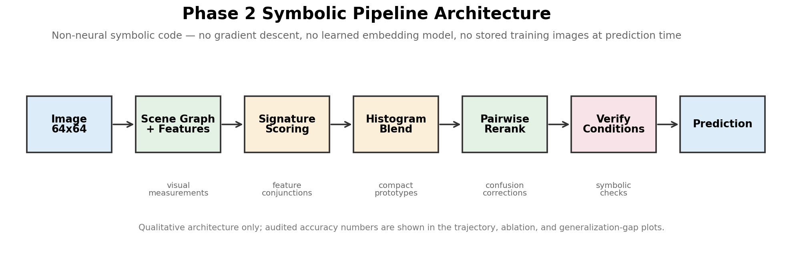
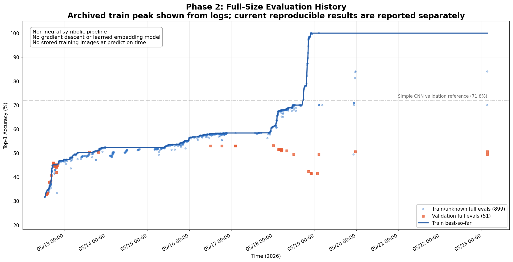
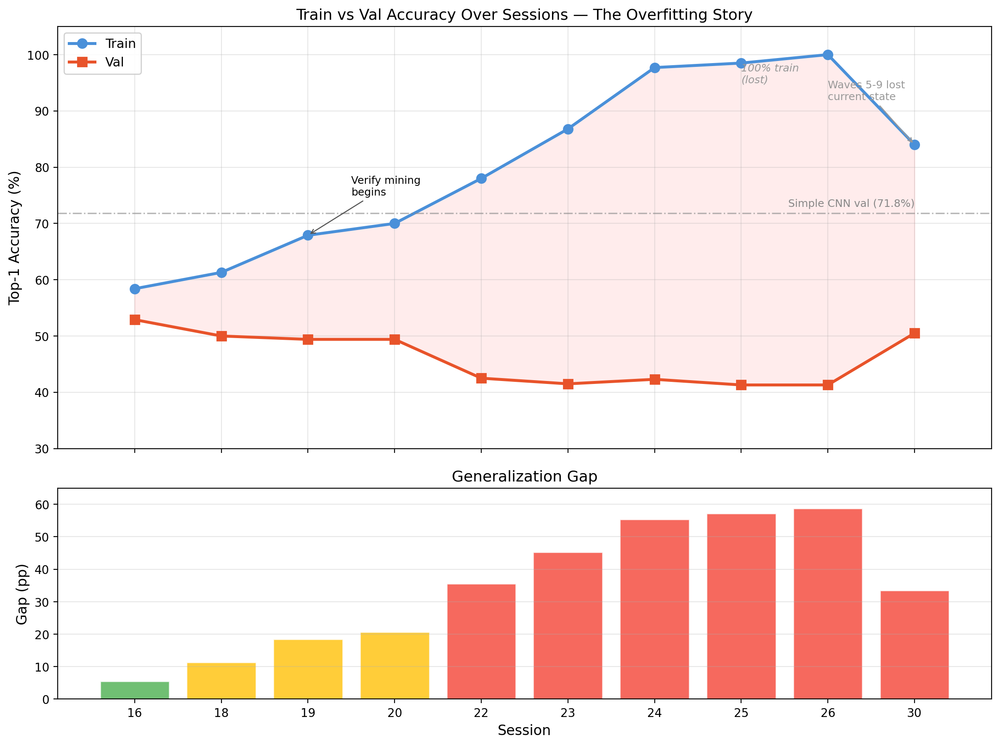
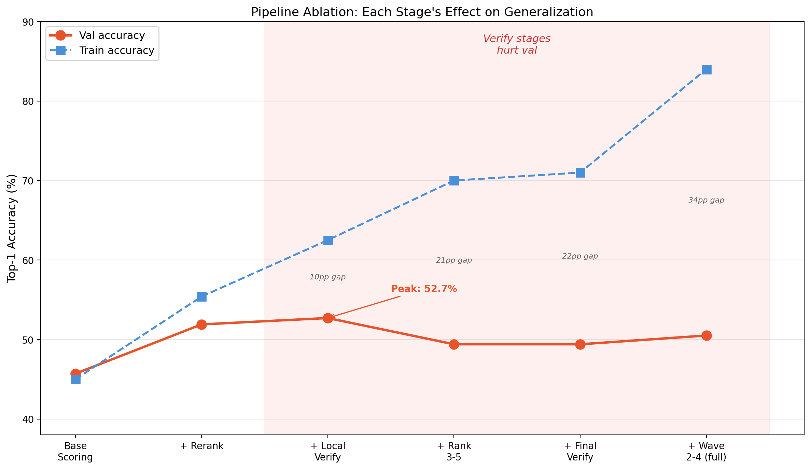
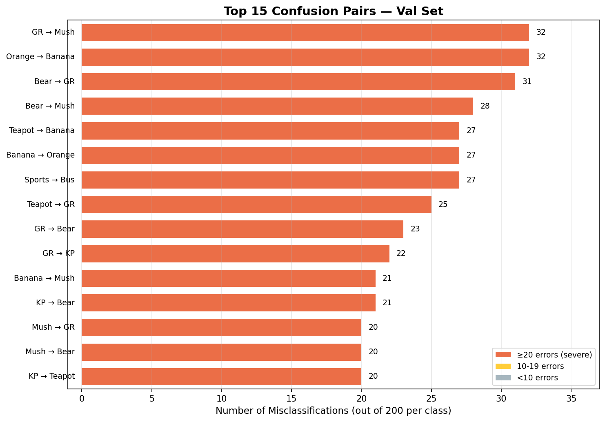
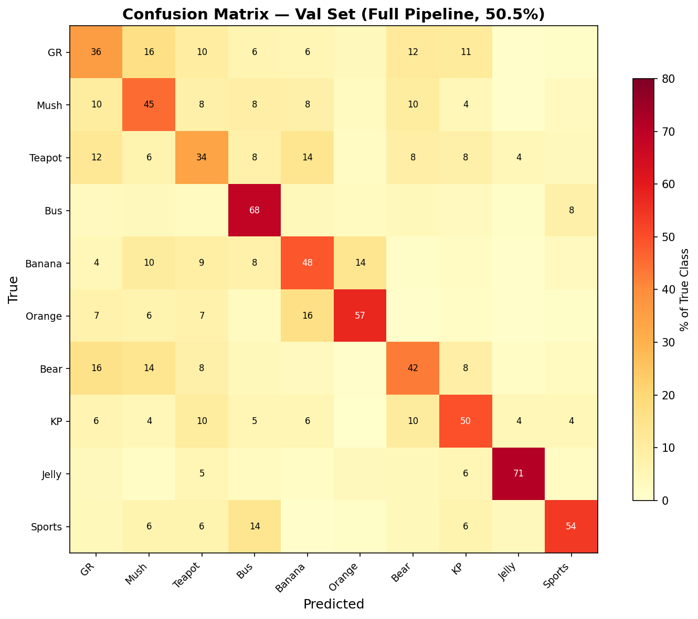
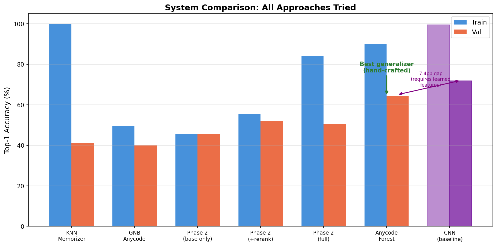

# Phase 2: Heuristic Learning for Symbolic ImageNet-10

*What happened when Claude Code and Codex helped iteratively improve a non-neural symbolic vision system.*

---

## The Question

Phase 1 showed that a coding agent could grow a symbolic image classifier from feedback. It also showed why the first result was not enough: the setup mixed real and synthetic classes, tuned on the same development images, and did not cleanly answer the generalization question.

Phase 2 was the stricter version:

The central question was whether a symbolic, non-neural vision system could improve on a real 10-class ImageNet-style task through iterative rule discovery.

The system was built and maintained with Claude Code and Codex acting as research copilots. The loop was simple:

```text
run evaluation
inspect errors
propose visual heuristics
edit code
rerun train/val
keep or revert
repeat
```

This was not training a neural network. The object being updated was a codebase.

---

## Setup

The task is 10-way classification on 64x64 Tiny ImageNet images.

The Phase 2 classes are:

- `banana`
- `brown_bear`
- `golden_retriever`
- `jellyfish`
- `king_penguin`
- `mushroom`
- `orange`
- `school_bus`
- `sports_car`
- `teapot`

The main train and validation evaluations use 2,000 images each, 200 per class.

The constraints were:

- no neural network in the symbolic pipeline;
- no backpropagation;
- no learned embedding model;
- no stored training images used at prediction time;
- prediction must come from symbolic visual features, scoring rules, reranking, and verification rules.

There is an important caveat. The system is not "parameter free." It contains tuned thresholds, score offsets, histogram prototypes, pairwise discriminant constants, and verification conditions. Those are learned or fitted artifacts in the broad sense. The accurate claim is narrower: there is no neural network, no gradient descent, and no weight matrix in the main symbolic pipeline.

---

## Current Reproducible Results

After the latest reproducibility audit, these are the current audited numbers:

| System | Train | Val | Reading |
|---|---:|---:|---|
| `base_rerank` | 55.4% | 51.9% | Best generalizing symbolic core |
| `full` verify-rule system | 84.0% | 50.5% | Higher train, larger generalization gap |
| archived historical endpoint | 100.0% train | not current ground truth | Reached in logs, exact code state not currently reproducible |

The most important distinction is between **current reproducible** and **historical archived**.

The project did record historical 100% train runs. I am not using those as the current headline because the exact code state that produced them is not presently reproducible from `HEAD`. They remain part of the audit trail, but the rigorous current claim is:

```text
base_rerank: 55.4% train / 51.9% val
full verify: 84.0% train / 50.5% val
```

This contrast is sufficient for the main interpretation below: fitting can improve substantially, but the additional train accuracy does not automatically transfer.


*Figure 1. The main Phase 2 trajectory. The important visual pattern is the divergence between train optimization and validation transfer: the system can keep climbing on train, while the best currently reproducible symbolic core remains near the low-50s on validation. The archived 100% point is part of the audit trail, but it is not connected as the current reproducible endpoint.*

---

## What The Pipeline Became

The Phase 2 symbolic pipeline is not a single rule list. It grew into a layered classifier:

```text
image
  -> classical visual measurements
  -> class signatures
  -> histogram prototype blending
  -> calibration and repulsion
  -> pairwise reranking
  -> verify rules
  -> prediction
```

The features are mostly global or coarse spatial measurements: color coverage, saturation, texture variance, edge density, frequency ratios, quadrant statistics, object-like blobs, and class-specific discriminant signals.

The high-level scoring pipeline tries to answer:

- does this image look globally like each class?
- does a histogram prototype pull it toward or away from a class?
- if the top two classes are a known confusion pair, does a pairwise discriminant prefer one over the other?
- if a lower-ranked candidate has a strong visual signature, should it be rescued?

This is why the system is best understood as a **symbolic visual program**, not as a flat set of if-statements.



*Figure 2. The final hand-built pipeline is a staged program. That matters because later failures are not isolated rule mistakes; they are interactions between scoring, ranking, reranking, and verification stages.*

---

## Finding 1: Fitting Is Surprisingly Doable

The first notable result is that regression to the training set is highly achievable, even without neural networks.

By adding more visual conditions and verification rules, the system can recover many training errors. A verify rule is usually a narrow conjunctive condition:

```text
if current_prediction is A
and candidate B is nearby
and several visual measurements cross thresholds
then swap to B
```

These rules can be highly effective on train. They are executable corrections. The codebase learns to patch its own mistakes.

That is the part that felt counterintuitive at first. Symbolic systems are often imagined as brittle and low-capacity. But once a coding agent can repeatedly inspect errors, write conditions, run evaluations, and keep positive patches, the codebase becomes an optimizable object. It can absorb hundreds of corrections.

In other words:

> Regression / fitting the train set is achievable, even symbolically.

The archived 100% train endpoint is the extreme version of this phenomenon. The current reproducible 84.0% train system is the conservative version still present in the codebase.



*Figure 3. The full evaluation history shows why the 100% train result should be interpreted carefully. It was achieved in the experimental trajectory, but the public claim should distinguish historical logged endpoints from the currently reproducible code state.*

---

## Finding 2: Generalization Is The Hard Part

The deeper lesson is that fitting is not the same as learning reusable visual structure.

The `base_rerank` system reaches:

```text
55.4% train / 51.9% val
```

That gap is only 3.5 percentage points. This is the most transferable symbolic configuration among the systems currently being reported.

The full verify system reaches:

```text
84.0% train / 50.5% val
```

That is a 33.5 point gap. The extra train accuracy mostly does not transfer.

So the result is not "symbolic vision solves ImageNet-10." It does not. A small CNN baseline is still much stronger on validation. The useful result is more specific:

> Train-only heuristic learning over code can memorize, just like train-only gradient learning over parameters can memorize.

The medium is different. The failure mode is familiar.

In a neural network, overfitting appears as weights that encode training-set quirks. In this symbolic pipeline, overfitting appears as narrow thresholds, special-case swaps, and verification rules that rescue a few training images but do not reliably transfer to validation.

The code looks interpretable, but interpretability does not automatically imply generalization.



*Figure 4. The central Phase 2 pattern: the verify-rule system is much better on train, but not on validation. This is the main evidence that the issue is not whether symbolic code can fit examples; it is whether the fitted rules correspond to reusable visual structure.*



*Figure 5. The ablation story is more informative than the single final number. Val accuracy peaks at +Local Verify (52.7%), then drops as more verify stages are added. The later stages push train from 62% to 84% while val stays flat or drops — the signature of executable memorization.*

---

## Finding 3: Reranking Generalizes Better Than Verify Rules

The most transferable post-scoring component is pairwise reranking.

Many errors are not "the correct class had no evidence." Instead, the correct class was near the top, but the wrong class won by a small score gap. Pairwise reranking helps in exactly that situation.

For example:

- banana vs orange;
- brown bear vs golden retriever;
- teapot vs golden retriever;
- school bus vs sports car;
- mushroom vs brown bear.

A pairwise discriminant can ask a narrower question than the global classifier:

```text
if this is either banana or orange, which side has stronger evidence?
```

That kind of rule has a chance to generalize because it targets a reusable confusion structure. It is not trying to identify a single image. It is trying to separate two visual modes.

The verify rules are different. Many of them fire on small pockets of training images. They often combine several hard thresholds. Those rules can be useful diagnostics, but most are not good final-model components.

The working hierarchy is:

```text
base visual statistics: moderate transfer
pairwise reranking: best transfer
verify rules: high train gain, weak or negative transfer
```

This is why `base_rerank` is the clean symbolic baseline.



*Figure 6. The largest errors are structured rather than uniformly distributed. Many are natural object-level confusions at 64x64: warm fruit against warm fruit, furry animals against each other, and shape-defined objects against visually similar blobs.*



*Figure 7. The confusion matrix is useful because it shows where symbolic rules should be reusable pairwise operators rather than isolated fixes. A good rule should explain a repeated confusion pattern, not just rescue one image.*

---

## Finding 4: The Codebase Is The Model

Phase 2 made the heuristic-learning frame much more concrete.

In this project:

| Machine learning concept | Phase 2 equivalent |
|---|---|
| model | the codebase |
| parameters | thresholds, constants, prototypes, rule conditions |
| update step | a code patch |
| optimizer | coding agent plus evaluation feedback |
| reward | train accuracy, unless constrained otherwise |
| memory | logs, docs, plots, error audits |
| regularization | patch acceptance rules, held-out checks, simplicity constraints |

Once this mapping is explicit, the overfitting result is less surprising.

If the reward is train accuracy, the agent will optimize train accuracy. If narrow rules help train and the acceptance loop rewards them, the codebase accumulates narrow rules. The resulting artifact is not a clean human-designed symbolic theory of vision. It is an evolved program under selection pressure.

This is both promising and risky.

It is promising because the system can improve through ordinary software edits. It can keep memory in files, logs, and tests. It can be inspected. It can be patched. It can expose its own failure cases.

It is risky because a codebase can overfit while looking reasonable. Every individual patch may have a plausible explanation. The aggregate system can still become a memorizer.

---

## Reflection: What This Adds To Heuristic Learning

Jiayi Weng's heuristic-learning framing is useful because it shifts the unit of learning. The learned object does not have to be a dense parameter vector. It can be a maintained software system: code, diagnostics, logs, tests, tools, and procedures that improve under feedback.

Phase 2 supports that framing, but it also sharpens it.

In Weng's definition, HL has the same broad loop as reinforcement learning:

```text
state -> action -> feedback -> update
```

The difference is the substrate of the update. Deep RL updates neural-network parameters. HL updates software structure. Feedback can enter through rewards, tests, logs, videos, replays, or human judgment; the coding agent then edits policies, detectors, tests, configuration, or memory.

That maps almost directly onto this project:

| HL component | Phase 2 artifact |
|---|---|
| programmatic policy | `hlinet/classifier/predict.py` |
| state representation | symbolic image statistics, region features, class scores, candidate rankings |
| feedback channels | train/val evals, confusion matrices, per-class accuracy, error logs |
| experiment records | `logs/phase2/`, `logs/log_inventory.csv`, generated reports |
| memory | `docs/phase2/understanding/`, `docs/phase2/reflections/` |
| update mechanism | Claude Code / Codex proposing and applying code patches |

The experiment suggests that heuristic learning should not be understood as "rules instead of weights." That is too small. A single heuristic is not the learned object. The learned object is the **entire maintenance loop**:

```text
representation
-> feedback
-> diagnosis
-> patch proposal
-> evaluation
-> memory update
-> next patch
```

In Phase 2, that loop measurably changed the system. It accumulated visual features, discriminants, reranking mechanisms, verification stages, audit scripts, failure-pattern documents, and reproducibility tools. The repository became a form of memory. The codebase became the policy. The docs became the agent's long-term state.

That is the positive lesson for heuristic learning.

It also supports Weng's point that a Heuristic System is not an isolated `policy.py`. It is a policy plus representation, feedback channels, experiment records, tests or replays, memory, and an update mechanism. Phase 2 only became a real HS once the classifier, logs, audit scripts, plots, and understanding documents were connected into one loop.

But Phase 2 also shows that a heuristic-learning system needs the same conceptual machinery as any other learning system:

### 1. Objective design

The reward function matters. If the visible reward is train accuracy, the system will optimize train accuracy. It will not automatically discover generality merely because the updates are symbolic or human-readable.

This is the most important correction to a naive reading of heuristic learning. Code is not immune to reward hacking. It can exploit the reward in a literal way: by writing executable special cases.

Weng notes that HL can forget in engineering-shaped ways: a new rule can fix one scenario and break an old one, a narrow test can be exploited, and rules can pile up until the system is no longer maintainable. Phase 2 is a direct perception-domain example. Verify rules fixed training failures, but many did not transfer; the system accumulated executable memory rather than reusable visual concepts.

For HL, the reward should not be:

```text
accept patch if train accuracy improves
```

It should be closer to:

```text
accept patch if held-out transfer improves
and support is broad enough
and complexity is justified
and cascade risk is bounded
```

### 2. Regularization

Neural learning has many regularizers: architecture, weight decay, dropout, augmentation, early stopping, data scale. Heuristic learning needs analogous constraints for code edits.

A code patch can be regularized by:

- support: how many examples does it apply to?
- precision: how often does it help when it fires?
- transfer: does it survive inner-dev evaluation?
- complexity: how many thresholds and branches does it add?
- locality: how large is its blast radius in the pipeline?
- semantic reuse: does it define a reusable operator or a one-off correction?

This suggests a more general principle:

> If code is the model, then code complexity is model complexity.

Counting parameters is no longer the right complexity measure. The relevant quantities are rule count, branch depth, threshold specificity, support size, dependency depth, and downstream cascade radius.

### 3. Credit assignment

Weng's framing shows that coding agents can perform update steps directly in program space. Phase 2 shows why those update steps need credit assignment.

When a patch improves accuracy, we need to know why:

- Did a new feature capture real class structure?
- Did a threshold merely isolate one training image?
- Did a correction help one pair while corrupting another?
- Did an upstream score shift invalidate downstream assumptions?
- Is the patch still useful after neighboring rules are ablated?

Without this accounting, heuristic learning becomes greedy program search. It can still improve, but it will accumulate debt: hidden dependencies, brittle thresholds, and patches whose marginal contribution is unknown.

The symbolic analogue of backpropagation is not differentiating through pixels. It is assigning credit and blame across code edits.

### 4. Memory and reproducibility

Heuristic learning turns logs and docs into part of the learning system. That is an advantage: the agent can remember failed patterns, audit old decisions, and avoid repeating known traps.

But it creates a new requirement. If the codebase is the model, then a commit is a model checkpoint. If logs are memory, then log lineage is part of the experimental state. If a plot is used to tell the story, the script and input records must be auditable.

The historical 100% train endpoint exposed this directly. The result was achieved and logged, but the exact code state was not preserved cleanly enough to be the current reproducible artifact. That is not a side issue. It is a methodological lesson about heuristic learning as an experimental paradigm:

> Software-maintained learning systems need model-checkpoint discipline, not just source-control discipline.

### 5. Coupling complexity

Phase 2 also gives a concrete example of coupling complexity. A local rule does not stay local once it changes rankings that downstream rules consume. The agent is not only maintaining a list of heuristics; it is maintaining a coupled system with hidden dependencies.

This is exactly the kind of complexity Weng identifies: not lines of code, but the number of interdependent states, rules, tests, feedback signals, and historical constraints an update must respect. In Phase 2, the hard part was rarely writing one more condition. The hard part was knowing whether that condition would change candidate rankings, block another verify rule, or invalidate a downstream calibration assumption.

This suggests that the scalable form of heuristic learning is not unbounded rule accumulation. It is modularization under measurement:

- isolate stages;
- measure blast radius;
- keep ablation tools;
- prefer low-cascade patches;
- periodically prune rules;
- preserve simple baselines;
- promote repeated patches into reusable abstractions.

In that sense, Phase 2 is both a validation and a warning for the HL paradigm.

It validates the idea that a coding agent can maintain and improve a non-neural policy through feedback. But it warns that improvement pressure alone does not produce scientific concepts. Without held-out selection and patch regularization, the system learns executable memories.

It also tests one of Weng's explicit boundaries. Weng argues that HL is bounded by what code can express, especially in complex perception and long-horizon generalization, and he specifically raises ImageNet as a hard case for pure Python without neural networks. Phase 2 does not solve ImageNet. It gives a more precise boundary:

```text
symbolic, non-neural HL can fit and partially generalize ImageNet-10,
but the unresolved bottleneck is reusable visual representation and generalization.
```

That is why the result is interesting. It does not refute the boundary; it locates it.

The research program that follows is therefore not "replace neural networks with rules." It is:

> Build learning systems where code is the editable substrate, but where the update loop has explicit objectives, regularization, credit assignment, memory, and reproducibility.

That is the version of heuristic learning that Phase 2 points toward.

---

## Finding 5: Cascade Dynamics Make Symbolic Systems Fragile

A common assumption is that symbolic systems are modular: add a rule, improve one case, leave the rest unchanged.

Phase 2 contradicted that.

The pipeline is sequential. A change to an early score can change the ranking. A ranking change can change which pairwise discriminant runs. That can change which verify rule fires. A small upstream patch can therefore cause downstream regressions far away from the intended target.

This produced a recurring pattern:

```text
local improvement
-> changed ranking distribution
-> different verify path
-> unexpected regressions
-> revert or add more special cases
```

As the train accuracy increased, the system became harder to modify. More correct predictions depended on the exact interaction between score gaps, pairwise reranking, and verify conditions. The higher the train score, the less slack remained.

This is the symbolic version of a familiar optimization problem: the system reached a sharp local optimum. Any small move risked breaking something.

---

## Why The Historical 100% Still Matters

The archived 100% train result should not be the headline current claim, because the exact code state is not currently reproducible.

But it still matters for interpretation.

It shows that a symbolic heuristic-learning loop can keep pushing train accuracy until the code behaves like a memorizer. The important part is not that 100% train is useful. It is not. The important part is that the same overfitting pressure can appear in a non-neural medium.

The shape of the lesson is:

```text
symbolic code + train-only feedback + enough iterations
    -> executable memorization
```

That is the Phase 2 result I would want other people to take seriously.

---

## What Phase 2 Does Not Show

This experiment does not show that symbolic image classification beats neural networks.

It does not show that hand-written visual rules are the best way to solve ImageNet.

It does not show that the current symbolic representation is sufficient.

It also does not show that an LLM can discover a clean, general visual ontology just by iterating on train accuracy.

The evidence points the other way: without a generalization-aware update rule, the agent will eventually optimize the reward it sees. If the visible reward is train accuracy, the program will become a train-set specialist.

---

## What Phase 2 Does Show

Phase 2 supports a more careful claim:

1. A coding agent can maintain and improve a non-neural symbolic vision pipeline over many iterations.
2. The pipeline can recover meaningful visual structure: color modes, texture cues, pairwise confusions, and class-specific discriminants.
3. Pairwise reranking is a useful symbolic mechanism because it attacks reusable confusion structure.
4. Verification rules can strongly improve train accuracy.
5. Most verification rules do not transfer well.
6. Train-only heuristic learning overfits by writing code that memorizes.
7. The next theory of heuristic learning needs regularization, held-out selection, and patch-level credit assignment.

That is a useful result even though the validation accuracy is modest.

---

## Diagnosis: What Separates This From CNNs

The Phase 2 evidence changes the diagnosis.

If the symbolic system had saturated at low training accuracy, the natural conclusion would be representational incapacity: the feature language would simply be too weak to express the task. But the train trajectory argues for a narrower conclusion. The symbolic representation plus thresholds plus verify rules can separate a large fraction of the training set, and the archived endpoint shows that the search process could reach complete training-set separation.

That does not mean the representation is sufficient for vision. It means the representation is sufficient for **finite-sample separation**. The remaining failure is not whether a symbolic program can carve up the 2,000 training images. It is whether the program can select rules that correspond to reusable visual structure.

This distinction matters:

```text
training-set separability != visual generalization
```

The current gap to CNNs appears to have four components.

### 1. Learned reusable representation

The Phase 2 feature inventory is dominated by global or coarse spatial statistics: color coverage, saturation, edge density, texture variance, histogram prototypes, quadrant statistics, frequency bands, and a limited set of contour or region descriptors. These features are informative, but they compress a 64x64 RGB image into a small set of hand-defined scalar measurements.

The resulting information loss is structural. Mean saturation cannot distinguish a yellow object in the center from yellow background at the border. Total green coverage mixes foreground and background. A global edge statistic cannot represent "rectangular windows along the upper side of a vehicle" or "handle and spout attached to a rounded body."

CNNs attack exactly this problem with learned local filters and hierarchical composition:

```text
local edges -> textures -> parts -> object configurations
```

The symbolic pipeline has hand-coded approximations of some of these signals, but it does not learn a reusable local representation from data.

### 2. Inductive bias and regularization

Convolution gives CNNs a strong prior: the same local pattern can matter in many positions. Weight sharing, local receptive fields, pooling, and augmentation all push the model toward reusable visual motifs rather than image-specific thresholds.

The verify-rule pipeline has a different bias. It rewards rules that fix current training errors. Many such rules have the form:

```text
if pair == {A, B}
and candidate rank/margin has a certain shape
and feature_1 > threshold_1
and feature_2 < threshold_2
then swap to B
```

These rules are interpretable as code, but they are not necessarily semantic. A rule can be understandable and still be a training-set partition. Interpretability is not regularization.

This is why the same symbolic feature language can produce two different regimes:

- `base_rerank`: lower train accuracy, small generalization gap;
- `full` verify: much higher train accuracy, much larger generalization gap.

The difference is not only the features. It is the acceptance pressure placed on the features.

### 3. Credit assignment over patches

Deep learning has backpropagation. It is opaque, but it assigns error signal across many parameters in a coordinated way.

The Phase 2 heuristic loop mostly used greedy patch search:

```text
add patch -> run eval -> keep or revert
```

That is a weak credit-assignment mechanism for a multi-stage program. A patch can help directly while harming downstream rankings. A feature can be discriminative in isolation but undeployable because it changes score distributions that later stages depend on. A verify condition can look zero-risk for one pair and still cause regressions through shared ranking state.

The understanding files repeatedly show this pattern: cascade amplification, zero-sum pair dynamics, duplicate or dead conditions, rank-dependent side effects, and frozen-system behavior after many verify waves. These are credit-assignment failures at the level of source code.

### 4. Search over abstractions, not just corrections

CNNs do not merely add corrections for individual training errors. They learn reusable filters that participate in many decisions.

The symbolic loop often searched for the next correction:

```text
find a condition that fixes these errors
```

The next loop should search for reusable operators:

```text
invent a visual procedure that explains a family of errors
```

Examples of the right target are not "banana vs orange threshold 0.6686" but operators such as:

- `has_elongated_warm_region()`;
- `has_repeated_rectangular_windows()`;
- `has_cap_like_blob_above_stem()`;
- `has_fur_texture_region()`;
- `has_black_white_body_pattern()`;
- `has_handle_or_spout_candidate()`;
- `has_local_pattern_somewhere()`.

Some early region features already move in this direction, but the current system still lacks the translation-invariant, multi-scale, part-based representation that makes such operators robust.

The compact diagnosis is:

> The gap to CNNs is not fitting capacity. It is learned reusable representation plus regularized credit assignment.

Or more carefully:

> Phase 2 suggests that symbolic features can separate the training set when enough thresholded corrections are allowed. The gap to deep learning is that CNNs learn reusable local representations under strong inductive biases, while the current symbolic loop accumulates global statistics and narrow correction rules unless explicitly regularized.



*Figure 8. The comparison to the small CNN is not meant as a leaderboard claim. It is a diagnostic: learned representation still gives a much stronger validation result than the current hand-built symbolic representation.*

---

## Remaining Challenges

### 1. Generalization-aware rule acceptance

The current lesson is clear: do not accept rules only because they improve train.

A better loop needs:

- train split for proposing candidate rules;
- inner dev split for accepting or rejecting rules;
- validation held back for audit only;
- final test held back until the end;
- rule-level support thresholds;
- explicit measurement of regressions.

The acceptance unit also needs to shrink. It is not enough to ask whether "full verify" helps. The system must ask whether each rule has enough support and transfers across examples.

### 2. Patch regularization

Heuristic learning needs the equivalent of regularization.

For code patches, that might mean:

- prefer shorter rules;
- penalize hard multi-threshold conjunctions with tiny support;
- require class-level or pair-level transfer;
- reject rules that only rescue one or two images;
- track marginal contribution after interactions with other rules;
- delete rules whose validation contribution is negative.

If code is the model, code needs regularization.

### 3. Credit assignment over code edits

Gradient descent has a credit-assignment mechanism. This symbolic loop mostly used greedy patch acceptance.

That is not enough when patches interact.

A future system needs to answer:

- which rule actually caused a correction?
- which rule caused a regression?
- which rules are redundant?
- which rules only work because another upstream rule changed the ranking?
- which feature should be improved instead of adding another threshold?

This is the "backpropagation for heuristic learning" problem, but not in the sense of differentiating through pixels. It means structured credit assignment over a program.

### 4. Better visual representation

The current features are too global and too weakly compositional.

Many hard errors require local or relational perception:

- a banana is elongated yellow, not just yellow;
- a school bus has window structure, not just yellow plus edges;
- a brown bear is a textured object against background, not just warm-brown pixels;
- a teapot has shape parts, not just metallic or ceramic color;
- a mushroom cap is a local structure, not a global texture statistic.

The next representation should move toward:

- foreground masks;
- region proposals;
- contour descriptors;
- local patch pooling;
- "pattern exists somewhere" detectors;
- object-part relations;
- spatial layouts beyond coarse quadrants.

The current symbolic system is mostly a global-statistics classifier with some region-level additions. The next one has to become more object-centered and more invariant: it should detect what local patterns exist without overfitting to exactly where they appeared in the training images.

### 5. Symbolic analogues of CNN inductive bias

A useful Phase 3 should not simply add more hand-coded features. It should ask what the symbolic analogue of convolutional inductive bias would be.

Candidate principles:

- local detectors should be reused across positions;
- rules should pool evidence over regions instead of depending on exact grid cells;
- part detectors should compose into object-level hypotheses;
- acceptance should reward transfer across held-out images, not only train rescue count;
- feature invention should prefer operators with support across many examples.

In this framing, CNNs are not just stronger because they have more parameters. They are stronger because their architecture makes certain generalizing hypotheses easy to find. A symbolic heuristic-learning system needs comparable structural bias.

### 6. Reproducibility discipline

Phase 2 also exposed a process problem.

The historical 100% endpoint was achieved, but the exact code state was not preserved cleanly enough to be the current reproducible artifact. The logs are now public and reorganized, but the lesson is blunt:

If a codebase is the model, then every meaningful model state needs to be checkpointed like a model.

Future iterations should freeze named artifacts:

- exact commit;
- exact config;
- exact eval command;
- train/dev/val/test split definition;
- generated logs;
- plot script inputs;
- result table.

Otherwise the story becomes harder to audit than it needs to be.

---

## The Phase 2 Takeaway

The most compact summary is:

> Fitting is doable. Generalization is the problem.

More precisely:

> A coding agent can use heuristic learning to improve a symbolic image classifier, but train-only feedback turns the codebase into a memorizer. The interesting research problem is not how to add more rules. It is how to make rule discovery generalize.

That is where Phase 2 leaves the project.

The next phase should stop chasing train accuracy. It should build a generalization-aware heuristic-learning loop: held-out selection, patch regularization, better visual primitives, and credit assignment over code edits.

The goal is not to prove that symbolic vision beats neural networks. The goal is to understand what happens when code itself becomes the trainable object.

---

## References

Weng, J. (2026). *Learning Beyond Gradients*. Blog post. https://trinkle23897.github.io/learning-beyond-gradients/

## Suggested Citation

If you cite this project or blog post, please cite:

Wang, X. (2026). *Heuristic Learning for Symbolic ImageNet-10*. Project blog. https://github.com/xisen-w/hl-imagenet
